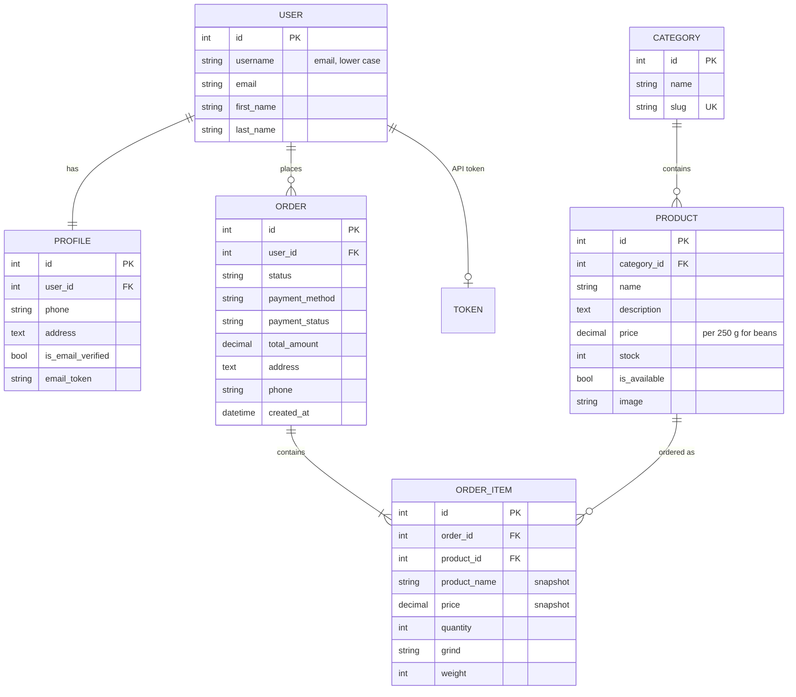
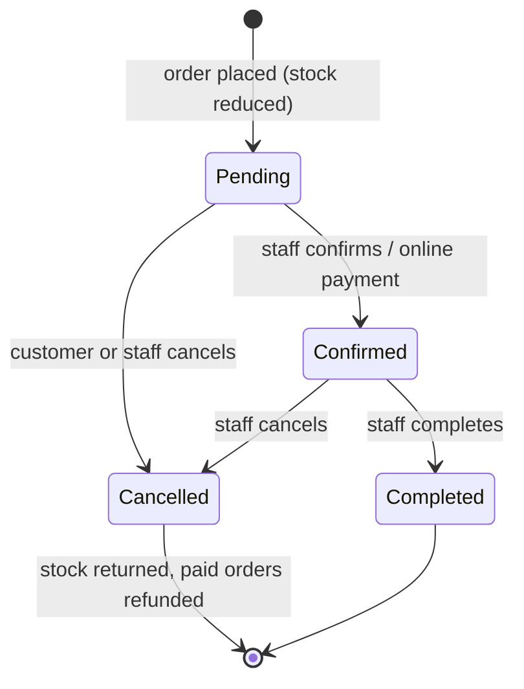

# Coffee Shop — Django E-commerce Backend

A backend-focused e-commerce application for a coffee shop, built with **Django 4.2** and **Django REST Framework** as a Scaler Academy backend project.

Customers can browse coffee beans, canned coffee and brewing equipment, choose grind and packet weight for beans, add items to a cart, check out with cash on delivery or a demo online payment, and track or cancel their orders. The same features are available through a **token-authenticated REST API** with interactive Swagger documentation.

---

## Table of contents

1. [Features](#features)
2. [Tech stack](#tech-stack)
3. [Project structure](#project-structure)
4. [Setup (Windows)](#setup-windows)
5. [Running the tests](#running-the-tests)
6. [Website pages](#website-pages)
7. [REST API](#rest-api)
8. [Data model](#data-model)
9. [Order lifecycle](#order-lifecycle)
10. [Design decisions](#design-decisions)
11. [Known limitations](#known-limitations)

---

## Features

| Area | Features |
|---|---|
| **Accounts** | Email-based sign up and login (case-insensitive), POST-only logout, profile page (name, phone, address), email verification link, password reset |
| **Catalogue** | 3 categories seeded by data migrations, product search, sort by name/price, pagination, hide products with `is_available` |
| **Coffee bean options** | 4 grind types and 4 packet weights (250 g – 1 kg); price scales with weight |
| **Cart** | Session-based cart, separate lines for different grind/weight, quantity 1–20 per line |
| **Checkout** | Stock is checked and reduced inside a database transaction with row locking; prices are saved on each order item |
| **Orders** | Order history, order detail, customer cancellation while pending, stock returned on cancel |
| **Payments** | Cash on delivery or a demo online payment (no real gateway) with paid/refunded status |
| **Admin** | Manage products and stock inline; change order status only through actions that follow the allowed flow |
| **REST API** | Products, categories, auth (token), profile, orders, cancel, pay, staff-only status changes, Swagger docs |
| **Quality** | 117 automated tests with 99% code coverage, logging of key events, secrets loaded from `.env` |

## Tech stack

- **Python 3.12**, **Django 4.2 LTS**
- **Django REST Framework 3.16** with token authentication
- **drf-spectacular** for the OpenAPI schema and Swagger UI
- **SQLite** database (no separate database server needed)
- **python-dotenv** for loading settings from `.env`
- **Pillow** for product images

## Project structure

```
coffee_shop/
├── coffee_shop/        # Project settings and root URLs
├── accounts/           # Sign up, login, profile, email verification, password reset
├── products/           # Category and Product models, catalogue pages, search
├── cart/               # Session cart (cart.py) and cart pages
├── orders/             # Order models, checkout, order history, admin actions
│   └── services.py     # Shared order-placing logic used by the website and the API
├── api/                # REST API: serializers, views, URLs
├── home/               # Home page
├── base/               # Shared abstract model and base CSS
├── templates/          # HTML templates for every app
├── .env.example        # Template for local settings
└── requirements.txt
```

## Setup (Windows)

**Requirements:** Python 3.10 or newer, and Git.

1. **Clone the repository**

   ```bash
   git clone https://github.com/Danish8879/Coffee_shop.git
   cd Coffee_shop
   ```

2. **Create and activate a virtual environment**

   ```bash
   python -m venv .venv
   .venv\Scripts\activate
   ```

3. **Install dependencies**

   ```bash
   pip install -r requirements.txt
   ```

4. **Create your `.env` file** by copying the example, then set your own secret key:

   ```bash
   copy .env.example .env
   ```

   Generate a key and paste it as `DJANGO_SECRET_KEY` in `.env`:

   ```bash
   python -c "from django.core.management.utils import get_random_secret_key; print(get_random_secret_key())"
   ```

   | Variable | Meaning | Example |
   |---|---|---|
   | `DJANGO_SECRET_KEY` | Secret key used for sessions and tokens (required when `DJANGO_DEBUG` is off) | a long random string |
   | `DJANGO_DEBUG` | Show debug pages and serve media files | `True` |
   | `DJANGO_ALLOWED_HOSTS` | Comma-separated host names | `localhost,127.0.0.1` |
   | `DJANGO_LOG_LEVEL` | Console log level | `INFO` |

   > Without a `.env` file, `DEBUG` is off and the app refuses to start without a secret key. This is intentional so the project is never run with an insecure default by accident.

5. **Create the database.** Migrations also add the starter catalogue (10 products in 3 categories):

   ```bash
   python manage.py migrate
   ```

6. **Create an admin account**

   ```bash
   python manage.py createsuperuser
   ```

7. **Start the server**

   ```bash
   python manage.py runserver
   ```

   Open http://127.0.0.1:8000/ for the shop, http://127.0.0.1:8000/admin/ for the admin, and http://127.0.0.1:8000/api/docs/ for the API documentation.
   On Windows you can also double-click `launch coffee_shop.bat`.

> **Emails** (verification and password reset) are printed in the terminal running `runserver` instead of being sent. Copy the link from there into your browser.

## Running the tests

```bash
python manage.py test
```

117 tests cover models, forms, the cart, checkout, stock handling, order status rules, admin actions, accounts, email flows and every API endpoint, including permission checks (for example, a user cannot see or cancel another user's order).

To measure coverage (currently **99%**):

```bash
pip install coverage
coverage run --source=accounts,api,cart,home,orders,products --omit="*/migrations/*,*/tests.py,*/test_*.py" manage.py test
coverage report
```

## Website pages

| URL | Page | Login needed |
|---|---|---|
| `/` | Home with categories | No |
| `/products/category/<slug>/` | Products in a category (`?sort=name`, `price_low`, `price_high`, `?page=`) | No |
| `/products/search/?q=` | Search products | No |
| `/products/<id>/` | Product detail and add to cart | No |
| `/cart/` | Cart | No |
| `/orders/checkout/` | Checkout | Yes |
| `/orders/` and `/orders/<id>/` | Order history and detail (cancel, pay) | Yes |
| `/accounts/register/`, `/accounts/login/` | Sign up and log in | No |
| `/accounts/profile/` | Profile and recent orders | Yes |
| `/accounts/password-reset/` | Forgot password | No |
| `/admin/` | Django admin | Staff |

## REST API

Base URL: `http://127.0.0.1:8000/api/`

Interactive documentation: **`/api/docs/`** (Swagger UI) · OpenAPI schema: **`/api/schema/`**

### Authentication

Log in (or register) to get a token, then send it in the `Authorization` header:

```
Authorization: Token <your-token>
```

If you are logged in on the website, the browsable API and Swagger docs also work with your session.

### Endpoints

| Method | Endpoint | Access | Description |
|---|---|---|---|
| `GET` | `/api/categories/` | Anyone | List categories |
| `GET` | `/api/products/` | Anyone | List available products. Query: `?search=`, `?ordering=price` / `-price` / `name`, `?category=<slug>`, `?page=` |
| `GET` | `/api/products/<id>/` | Anyone | Product detail |
| `POST` | `/api/auth/register/` | Anyone | Create an account, returns a token |
| `POST` | `/api/auth/login/` | Anyone | Get a token |
| `POST` | `/api/auth/logout/` | Logged in | Delete your token |
| `GET` / `PATCH` | `/api/profile/` | Logged in | View or update name, phone and address |
| `GET` | `/api/orders/` | Logged in | Your orders (staff see all orders) |
| `POST` | `/api/orders/` | Logged in | Place an order |
| `GET` | `/api/orders/<id>/` | Owner or staff | Order detail |
| `POST` | `/api/orders/<id>/cancel/` | Owner | Cancel a pending order |
| `POST` | `/api/orders/<id>/pay/` | Owner | Demo payment for an online order |
| `POST` | `/api/orders/<id>/status/` | Staff | Move an order to its next status |

Lists are paginated (10 per page) and return `count`, `next`, `previous` and `results`.

### Examples

**Register**

```bash
curl -X POST http://127.0.0.1:8000/api/auth/register/ -H "Content-Type: application/json" -d "{\"first_name\": \"Asha\", \"last_name\": \"Rao\", \"email\": \"asha@example.com\", \"password\": \"Strong-pass-123\"}"
```

```json
{ "token": "9944b09199c62bcf9418ad846dd0e4bbdfc6ee4b", "email": "asha@example.com" }
```

**Log in**

```bash
curl -X POST http://127.0.0.1:8000/api/auth/login/ -H "Content-Type: application/json" -d "{\"email\": \"asha@example.com\", \"password\": \"Strong-pass-123\"}"
```

**Search products**

```bash
curl "http://127.0.0.1:8000/api/products/?search=estate&ordering=-price"
```

**Place an order.** Coffee beans need `grind` and `weight`; other products must not have them.

```bash
curl -X POST http://127.0.0.1:8000/api/orders/ -H "Authorization: Token <your-token>" -H "Content-Type: application/json" -d "{\"first_name\": \"Asha\", \"last_name\": \"Rao\", \"email\": \"asha@example.com\", \"address\": \"12 MG Road, Bengaluru\", \"phone\": \"9876543210\", \"payment_method\": \"online\", \"items\": [{\"product\": 2, \"quantity\": 2, \"grind\": \"french-press\", \"weight\": 500}, {\"product\": 6, \"quantity\": 1}]}"
```

```json
{
  "id": 7,
  "status": "pending",
  "status_display": "Pending",
  "payment_method": "online",
  "payment_status": "unpaid",
  "total_amount": "2400.00",
  "items": [
    { "product": 2, "product_name": "Araku Estate", "price": "1100.00", "quantity": 2, "grind": "french-press", "weight": 500, "subtotal": "2200.00" },
    { "product": 6, "product_name": "Bold and Strong", "price": "200.00", "quantity": 1, "grind": "", "weight": null, "subtotal": "200.00" }
  ],
  "...": "delivery details and timestamps"
}
```

**Pay for it (demo), then check the status**

```bash
curl -X POST http://127.0.0.1:8000/api/orders/7/pay/ -H "Authorization: Token <your-token>"
curl http://127.0.0.1:8000/api/orders/7/ -H "Authorization: Token <your-token>"
```

**Staff: complete an order**

```bash
curl -X POST http://127.0.0.1:8000/api/orders/7/status/ -H "Authorization: Token <staff-token>" -H "Content-Type: application/json" -d "{\"status\": \"completed\"}"
```

### Error responses

| Status | When |
|---|---|
| `400` | Invalid data, not enough stock, or a status change that is not allowed |
| `401` | Missing or invalid token |
| `403` | Logged in but not allowed (for example, a customer calling the staff status endpoint) |
| `404` | The object does not exist, or it is another user's order |
| `405` | Method not allowed (for example, editing or deleting an order) |

Example of a stock error:

```json
{ "items": ["Only 3 unit(s) of Moka Pot left in stock."] }
```

## Data model



- The cart is stored in the **session**, not the database. Each line is keyed as `product_id:grind:weight` for beans and `product_id` for other products.
- `OrderItem` keeps a copy of the product name and price, so later price changes never alter past orders.
- Deleting a product that appears in an order is blocked (`on_delete=PROTECT`).

## Order lifecycle



The allowed moves are defined once in `Order.ALLOWED_TRANSITIONS` and enforced everywhere: website, admin actions and API.

## Design decisions

- **One order service for website and API.** `orders/services.py` places every order, so stock checks, price calculation and price snapshots behave the same in both.
- **Stock safety.** Checkout runs in `transaction.atomic()` and locks product rows with `select_for_update()`. If any item is short, nothing is saved.
- **Query optimisation.** Product lists use `select_related('category')`, order lists use `prefetch_related('items')`, and the cart loads all of its products in one `id__in` query. Measured locally on 110 products and 50 orders:

  | Operation | Queries before → after | Time before → after |
  |---|---|---|
  | Product list (110 products) | 111 → 1 | 18.7 ms → 1.4 ms |
  | Order history API (50 orders × 3 items) | 51 → 2 | 26.5 ms → 13.0 ms |
  | Cart with 20 lines | 20 → 1 | 3.5 ms → 0.4 ms |

- **Security.** Secrets come from `.env`; logout is POST-only; users can only see and change their own orders; login redirects only to safe URLs; password rules are the same on website and API.
- **Logging.** Logins, failed logins, sign-ups, orders, payments and cancellations are logged to the console.

## Known limitations

- Payment is a demo: there is no real payment gateway.
- Emails are printed to the console; a real SMTP server is needed in production.
- SQLite suits development. PostgreSQL or MySQL is recommended for production because SQLite locks the whole database instead of single rows.
- For coffee beans, one packet counts as one unit of stock whatever its weight.
- The app is not deployed yet; HTTPS settings (`check --deploy` warnings) need to be enabled for production.
